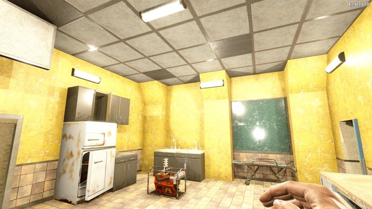
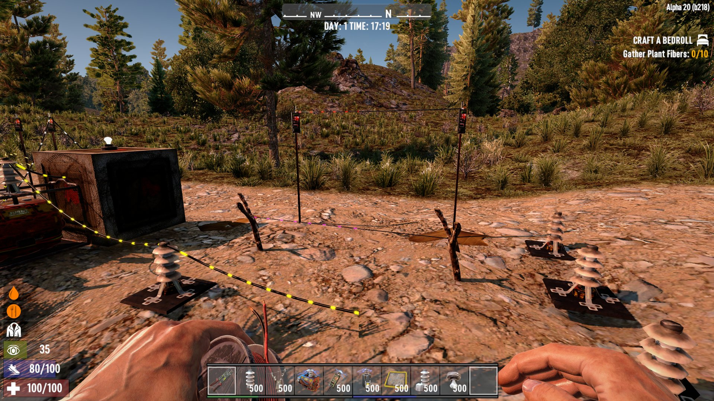

# OCB Electricity No Wire Mod - 7 Days to Die (A20) Addon

This mod will remove all visible wires when the wiring tool is not equipped,
except for trip wires and wires between fence posts. Doesn't have any additional
dependencies since A20, but was developed with [A20BepInExPreloader][1]

## Compatibility

I've developed and tested this Mod against version a20.b218.

[1]: https://github.com/OCB7D2D/A20BepInExPreloader